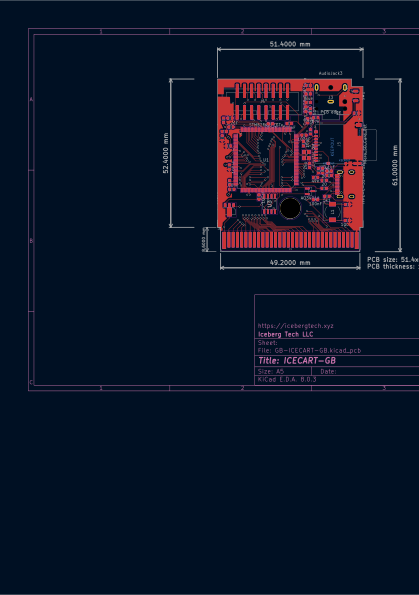

# Icecart-GB

Another ROM Cartridge for the Gameboy.
Purpose is to fit the form factor of a gameboy cartridge and act as a ROM cartridge while also providing an arduino-like interface.
Emulates the functionality of an official cart, with the different bank controllers implemented in software.

Interactive BOM: [GB-ICECART-GB-Alpha/bom/ibom.html](GB-ICECART-GB-Alpha/bom/ibom.html)

[Schematic](GB-ICECART-GB-Alpha/schematic/GB-ICECART-GB.pdf)

It should also have functionality similar to an arduino, where you can interface with it through GPIO and audio in/out.
It should be as low-power as possible, since it will run off the gameboy battery.
It should support an sd card for storage while powered off.

Requirements:

* STM32-type processor
  * low power
  * Enough pins for cart and GPIO (32+16)
  * rtc
* External mic + speaker 3.8mm jacks
* dac connection to gameboy cartridge audio line for input
* usb C for programming / updating
* 2x8 or 2x6 GPIO
* microsd card slot for storage
* 32Mbit serial ram
* Respond to gameboy cartridge read/write (1MHz ??? Not sure) 
  * 4Mihz for gameboy: [gekkio notes](https://gekkio.fi/files/gb-docs/gbctr.pdf) appendix C
  * 8Mihz for gameboy color?
  * More timing information: https://dhole.github.io/post/gameboy_cartridge_emu_1/
* gameboy dmg/color cartridge footprint
  * https://github.com/Gekkio/gb-hardware/tree/main/GB-BRK-CART
* FreeRTOS

Examples:

* emeryth-hacks: https://emeryth.net/stm32-game-boy-cartridge/
* gekkio: https://github.com/Gekkio/gb-hardware#gb-live32

References:

[Old Memory bank controllers](https://mgba-emu.github.io/gbdoc/#mbc)
[TPP1 mapper](https://github.com/aaaaaa123456789/tpp1)
